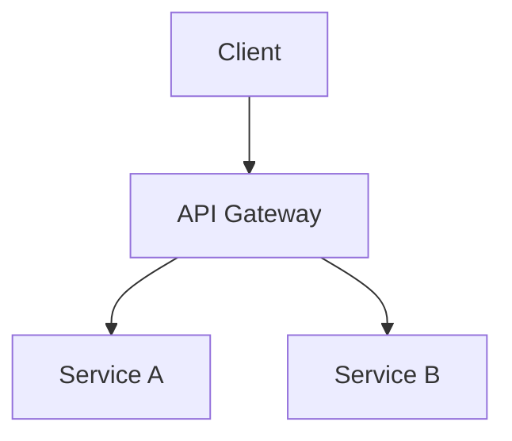

# Complete Obsidian Note Example

````markdown
---
title: Project Alpha
date: 2024-01-15
tags:
  - project
  - active
status: in-progress
aliases:
  - Alpha Project
cssclasses:
  - wide-page
---

# Project Alpha

This project aims to [[improve workflow]] using modern techniques.
See also: [[Team Members|the team]] and [[Budget 2024#Q1 Allocation]].

> [!important] Key Deadline
> The first milestone is due on ==January 30th==.

> [!warning]- Risk Register (click to expand)
> - Dependency on external API
> - Budget may shift in Q2

## Tasks

- [x] Initial planning
- [ ] Development phase
  - [ ] Backend implementation
  - [ ] Frontend design

## Technical Notes

The sorting algorithm runs in $O(n \log n)$ time. See [[Algorithm Notes#Sorting]] for derivation.

$$
T(n) = O(n \log n)
$$

### Architecture



## Resources

![[Architecture Diagram.png|600]]
![[Design Spec#Overview]]

Reviewed in [[Meeting Notes 2024-01-10#Decisions]].

This approach was first discussed in the planning session.^[See planning session notes from 2024-01-08.]

%%
TODO: Add post-mortem section after launch.
%%
````
