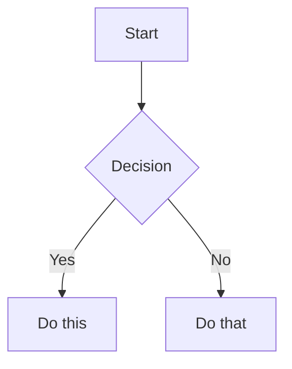

# Obsidian Syntax Extras

## Comments

```markdown
This is visible %%but this is hidden%% text.

%%
This entire block is hidden in reading view.
%%
```

Comments are stripped from reading view and exports. Useful for draft notes, reminders to self, or metadata you don't want rendered.

## Highlight

```markdown
==Highlighted text==
```

Renders as yellow background highlight in reading and live-preview modes.

## Math (LaTeX)

```markdown
Inline: $e^{i\pi} + 1 = 0$

Block:
$$
\frac{a}{b} = c
$$
```

Obsidian uses MathJax for rendering. Use `$...$` for inline, `$$...$$` for display blocks.

## Diagrams (Mermaid)

````markdown

````

To link Mermaid nodes to Obsidian notes, add `class NodeName internal-link;` inside the mermaid block.

Common diagram types: `graph`, `sequenceDiagram`, `gantt`, `classDiagram`, `pie`, `flowchart`.

## Footnotes

```markdown
Text with a footnote[^1].

[^1]: Footnote content here.

Inline footnote^[This is the footnote text inline.] in the sentence.
```

Named footnotes (`[^label]`) can be defined anywhere in the file. Inline footnotes (`^[...]`) are defined at point of use.
